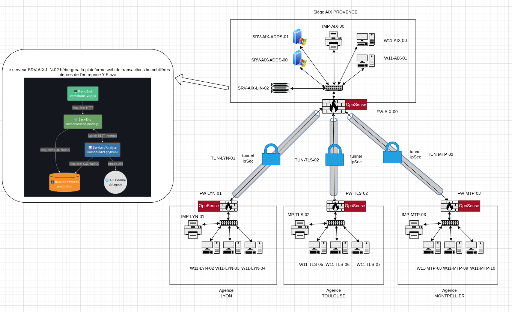

# Projet Fil Rouge - Bachelor 2 Ynov 2026

## 🚀 Présentation
**Y-Plaza** est un groupe immobilier national disposant d'un siège à Aix-en-Provence et de 12 agences réparties sur le territoire français. Ce projet consiste en la mise en place d'une infrastructure Hub & Spoke sécurisée et le développement d'une plateforme métier intelligente (IA).

### 👥 Collaborateurs
- **Mir Mahan**
- **Loan Mata**
- **Allen Jolan**

---

## 📂 Structure du Dépôt

- [**`app/`**](./app/) : Code source des micro-services (Backend NestJS, Frontend Vue.js, Predict FastAPI).
- [**`docs/`**](./docs/SUMMARY.md) : Documentation technique complète (Infra & Dev).
- [**`deliverables/`**](./deliverables/) : Rapports finaux et livrables de soutenance.

---

## 🏗️ Architecture Globale

---

## 📜 Documentation Rapide
- [Plan d'Adressage IP](./docs/infrastructure/PLAN_ADRESSAGE_IP.md)
- [Politique de Sécurité (PSSI)](./docs/infrastructure/POLITIQUE_SECURITE.md)
- [Référence API](./docs/application/API.md)
- [Guide de Déploiement Docker](./docs/application/DEPLOYMENT.md)

---

## 🎓 Modalités de Soutenance
- **Durée** : 10 minutes DEV + 10 minutes INFRA.
- **Sujet officiel** : [Consulter le sujet (PDF)](./docs/SUJET_PROJET_B2.pdf)
