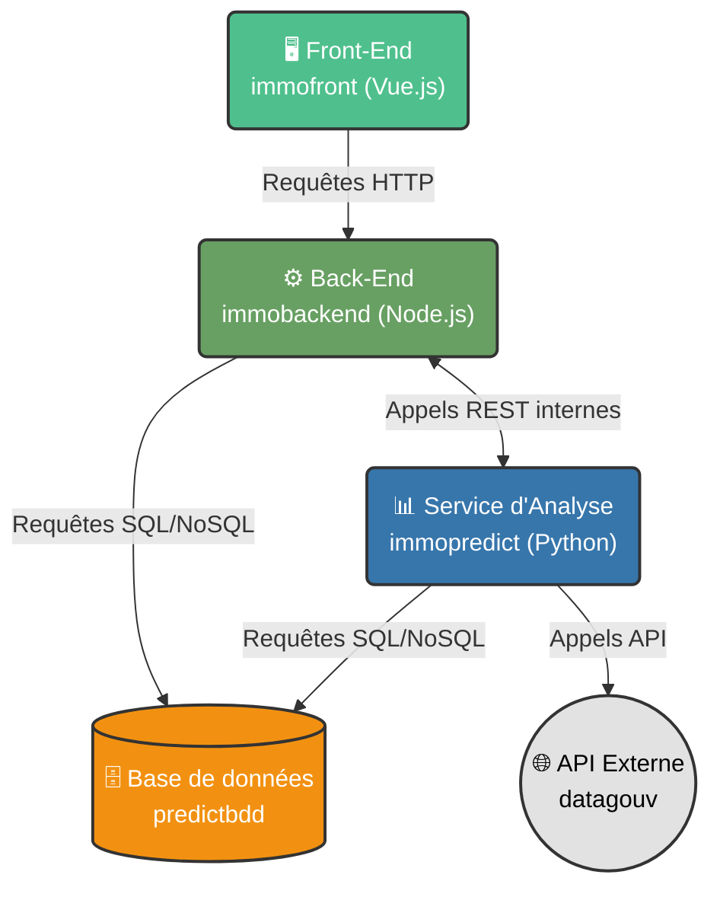

# Architecture générale du projet application immoapp

---
Collaborateur : Mir Mahan, Loan Mata, Allen Jolan

année : 2025/2026

---

# Introduction
> **Description** :
> cette architecture repose 
> 

