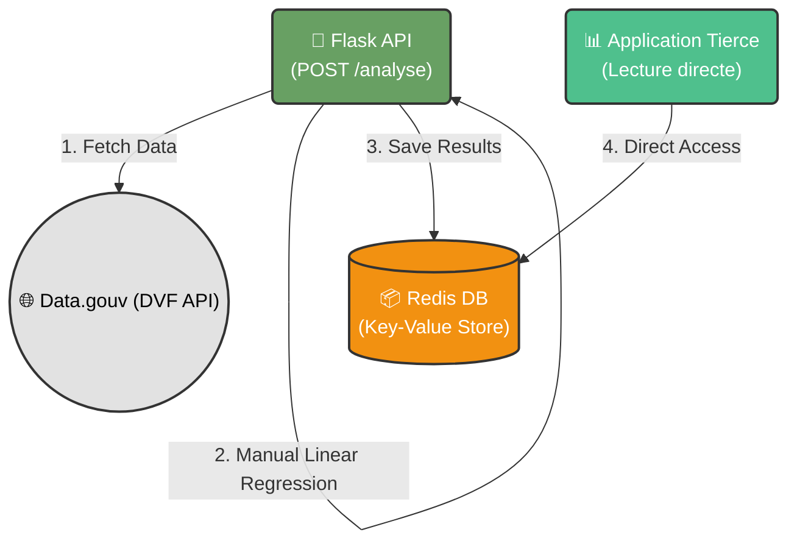

# Services Immopredict 
Analyse et prédiction linéaire des marchés immobiliers en France sur la base des données de Data.gouv.fr (DVF).

---
Collaborateurs : Mir Mahan, Loan Mata, Allen Jolan
Année : 2025/2026

---

## 🚀 Introduction
`immopredict` est un service de calcul de tendances immobilières. Il récupère les données de ventes réelles (DVF), effectue une **régression linéaire manuelle** ($y = ax + b$) pour corréler la surface au prix, et stocke les résultats dans une base **Redis**.

Les services tiers peuvent ensuite accéder directement aux résultats d'analyse dans Redis sans passer par l'API pour la lecture.

## 🏗️ Architecture & Principes
Le projet respecte les principes **SOLID** et utilise l'**Injection de Dépendances** :
- **Interfaces (`src/core/interfaces.py`)** : Définition des contrats pour le stockage, les sources de données et les prédicteurs.
- **Infrastructure (`src/core/database.py`)** : Implémentation Redis pour la persistance des statistiques.
- **Domaine/Logique (`src/core/processing.py`)** : 
    - `ImmoGouvDataSource` : Récupération des données DVF via API.
    - `SimpleLinearPredictor` : Calcul mathématique de la pente ($a$) et de l'ordonnée à l'origine ($b$) sans bibliothèques d'IA.

## 📡 API REST (Flask)
L'API expose un seul point d'entrée pour déclencher une analyse :

### `POST /api/v1/analyse`
Déclenche la récupération des données pour une zone et calcule les paramètres de prédiction.
- **Body** : `{"code_postal": "75001"}`
- **Réponse** : Les paramètres `slope` ($a$) et `intercept` ($b$).
- **Effet de bord** : Enregistre le résultat dans Redis sous la clé `market:{code_postal}`.

## 🛠️ Stack Technique
- **Backend** : Flask (Python)
- **Traitement de données** : Polars
- **Stockage** : Redis
- **Requêtes HTTP** : Requests

## 📊 Schéma de flux

